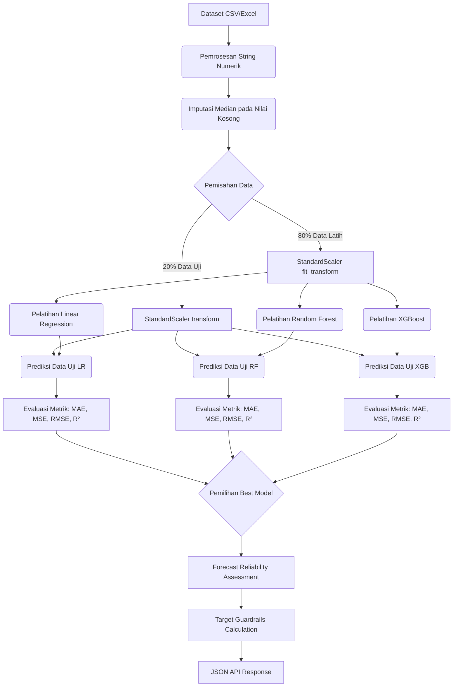
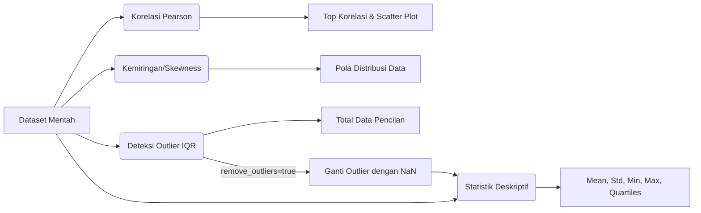
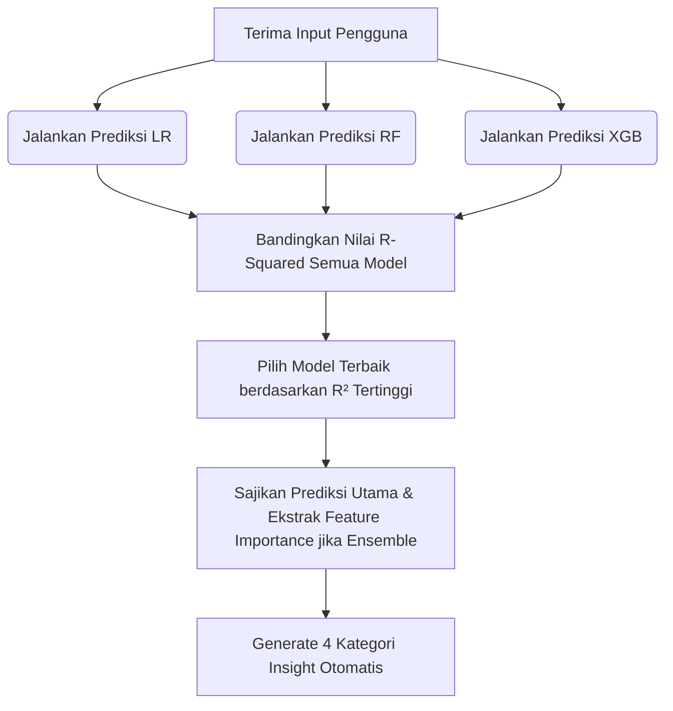
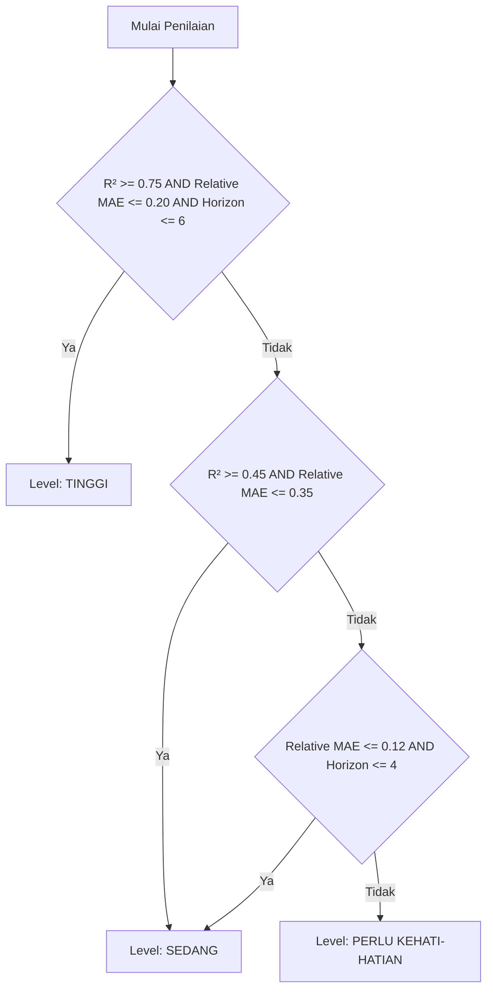

# 📘 Technical Documentation — Statistika & Machine Learning

Dokumen ini menjelaskan secara rinci alur, pemrosesan matematika, serta kalkulasi statistika yang terjadi di belakang layar (backend) pada Sistem Statistik Prediktif (Statisy). Semua proses pemodelan dienkapsulasi di dalam kelas `PredictiveModel` pada file `backend/ml_model.py`.

---

## 1. Alur Kerja Utama (Workflow Keseluruhan)

Diagram di bawah ini menggambarkan alur lengkap *end-to-end* sejak data diinput hingga model menghasilkan metrik prediksi.

---

## 2. Prapemrosesan Data (Data Preprocessing)

Sebelum algoritma *Machine Learning* dapat memprediksi nilai target (misalnya *GDP Growth*), sekumpulan data harus melewati tahapan prapemrosesan yang ketat.

### 2.1 Pembersihan String Numerik (Data Cleaning)
Ketika data diunggah dalam format CSV atau Excel, banyak angka yang terbaca sebagai tipe string/teks akibat adanya karakter asing (seperti `Rp`, `%`, pemisah ribuan, atau koma desimal versi Indonesia). Sistem melakukan *parsing* dengan heuristik cerdas:
- Karakter non-numerik (selain angka, titik, koma, minus) dihapus.
- Jika terdapat pola format angka Indonesia (misalnya `1.000.000,50`), sistem akan menukarkan tanda koma menjadi desimal standar US (titik) agar dapat dibaca oleh NumPy dan Pandas.
- Kolom dikonversi ke tipe numerik hanya jika **>50%** nilai berhasil diparsing.

### 2.2 Imputasi Nilai Kosong (Missing Values)
Apabila dalam dataset terdapat baris yang kehilangan nilai (Missing/NaN) pada variabel numeriknya, nilai yang kosong tidak dihapus, melainkan **diimputasi menggunakan nilai Median**. 
- *Alasan menggunakan Median:* Tidak seperti Rata-rata (Mean), Median sangat kebal (*robust*) terhadap nilai pencilan (outliers) ekstrem yang sering ditemukan pada data ekonomi makro.

### 2.3 Pembagian Data (Train-Test Split)
Sistem menggunakan pendekatan *Hold-Out Validation* dari `scikit-learn`.
Dataset dibagi secara acak dengan proporsi **80:20**:
- **80% Data Pelatihan (Train Set):** Digunakan model untuk "belajar" menemukan pola historis.
- **20% Data Pengujian (Test Set):** Digunakan untuk menguji keakuratan model terhadap data yang tidak pernah dilihat sebelumnya.
- Pengacakan dilakukan dengan `random_state=42` agar eksperimen dan pembagian baris dapat direplikasi (reproducible).

### 2.4 Standarisasi Fitur (Feature Scaling)
Data ekonomi seperti "Populasi (Juta)" dan "Inflasi (%)" memiliki skala ukuran yang sangat berbeda jauh. Algoritma matematis akan kesulitan atau bias terhadap skala yang besar. Oleh karena itu, semua fitur ditransformasi menggunakan **StandardScaler (Z-Score Normalization)**:

$$
z = \frac{x - \mu}{\sigma}
$$

Di mana $x$ adalah nilai asli, $\mu$ adalah rata-rata (mean), dan $\sigma$ adalah standar deviasi. Hasilnya, setiap fitur akan terpusat di angka 0 dengan standar deviasi 1. Masing-masing model (Linear Regression, Random Forest, dan XGBoost) memiliki instance Scaler-nya sendiri agar tidak terjadi kebocoran data (*Data Leakage*).

---

## 3. Model Machine Learning

Sistem ini menjalankan **tiga algoritma** Regresi secara simultan (bersamaan) lalu membandingkan efisiensi hasil pemodelannya.

### 3.1 Linear Regression (Regresi Linear Berganda)
Model parametrik klasik yang mencari garis (atau bidang/hyperplane) lurus paling optimal (Ordinary Least Squares) untuk meminimalkan selisih jarak (*residuals*) antara prediksi dan aktual.

- **Formula Matematika:**

$$
y = \beta_0 + \beta_1 x_1 + \beta_2 x_2 + ... + \beta_n x_n + \epsilon
$$
- **Penjelasan:** $y$ adalah prediksi target (misal PDB), $x_i$ adalah fitur pendukung (inflasi, investasi, dsb.), $\beta_i$ adalah koefisien bobot tiap fitur, $\beta_0$ adalah *intercept* (konstanta dasar), dan $\epsilon$ adalah galat (*error*).
- **Penggunaan:** Digunakan sebagai dasar komparasi linear (baseline). Sangat baik dalam mendeteksi korelasi lurus namun akan gagal memodelkan tren ekonomi yang sangat berfluktuasi/non-linear.

### 3.2 Random Forest Regressor
Algoritma berbasis Ansambel (*Ensemble Learning*) berjenis pembagian (*bagging*) yang bekerja secara non-linear. Secara konseptual, model ini membangun puluhan Pohon Keputusan (*Decision Trees*), kemudian hasil tebakan semua pohon "dirata-rata" untuk mendapatkan satu angka regresi penengah.

- **Hyperparameter Tuning (Bawaan):**
  - `n_estimators = 100`: Sistem menggunakan 100 pohon keputusan paralel.
  - `max_depth = 8`: Pohon maksimal bercabang 8 kali untuk menghindari *overfitting* yang umum terjadi pada dataset yang kecil.
  - `min_samples_split = 3`: Membutuhkan setidaknya 3 baris sampel untuk melanjutkan percabangan daun.
  - `min_samples_leaf = 2`: Sebuah ranting terakhir harus menaungi minimal 2 baris data.
  - `random_state = 42`: Seed untuk reprodusibilitas hasil.
  - `n_jobs = -1`: Menggunakan seluruh core CPU untuk pelatihan paralel.
- **Kelebihan dalam Statistika:** Mampu mengenali interaksi non-linear (misalnya: korelasi suku bunga terhadap inflasi tidak selalu lurus), serta secara intrinsik tangguh terhadap bahaya pencilan (*outliers*).

### 3.3 XGBoost Regressor
Algoritma berbasis *Gradient Boosting* yang membangun serangkaian pohon keputusan secara sekuensial, di mana setiap pohon berusaha memperbaiki kesalahan dari pohon sebelumnya. Sistem mendukung fallback ke `GradientBoostingRegressor` dari `scikit-learn` jika library `xgboost` tidak tersedia di *environment*.

- **Hyperparameter Tuning:**
  - `n_estimators = 200`: Membangun 200 pohon berurutan.
  - `max_depth = 4`: Kedalaman setiap pohon dibatasi 4 untuk mencegah *overfitting*.
  - `learning_rate = 0.05`: Menurunkan bobot setiap pohon untuk membuat model lebih konvergen secara bertahap.
  - `subsample = 0.8`: Mengambil 80% data latih secara acak untuk melatih setiap pohon.
  - `colsample_bytree = 0.8`: Mengambil 80% fitur secara acak untuk setiap pohon.
  - `reg_alpha = 0.1` & `reg_lambda = 1.0`: Regularisasi L1 (Lasso) dan L2 (Ridge) untuk mengurangi kompleksitas model.
  - `early_stopping_rounds = 20`: Pelatihan akan dihentikan jika performa pada data uji tidak membaik selama 20 ronde beruntun (untuk mencegah *overfitting*).
- **Kelebihan dalam Statistika:** Sangat handal untuk dataset tabular kompleks dengan regularisasi *built-in* dan kemampuan konvergensi tinggi berkat algoritma optimalisasi *gradient descent*. Evaluasi metrik juga mengekstrak iterasi optimal `best_iteration`.

---

## 4. Metrik Evaluasi Model

Setelah model dilatih dengan 80% data, 20% sisa data (X_test) ditebak oleh mesin. Lalu hasil tebakannya dibandingkan dengan realita aslinya (y_test) menggunakan formula statistika berikut:

1. **MAE (Mean Absolute Error):**

$$
MAE = \frac{1}{n} \sum_{i=1}^{n} | y_i - \hat{y}_i |
$$

   Menghitung rata-rata nilai mutlak dari selisih simpangan. Nilai ini menggambarkan dengan bahasa intuitif: *"Secara rata-rata, prediksi mesin meleset sebesar {MAE} poin"*.

2. **MSE (Mean Squared Error):**

$$
MSE = \frac{1}{n} \sum_{i=1}^{n} (y_i - \hat{y}_i)^2
$$

   Selisih simpangan dikuadratkan. Digunakan secara internal sebagai basis perhitungan RMSE. Sensitif terhadap kesalahan besar (*outliers*).

3. **RMSE (Root Mean Squared Error):**

$$
RMSE = \sqrt{ \frac{1}{n} \sum_{i=1}^{n} (y_i - \hat{y}_i)^2 }
$$

   Akar dari MSE sehingga satuannya kembali sama dengan target. Penalti sangat memberatkan galat/kesalahan yang besar (*large errors/outliers*). Idealnya RMSE sangat dekat dengan nilai MAE. Jika RMSE jauh di atas MAE, artinya model memiliki sedikit kesalahan tetapi berbobot amat fatal.

4. **R-Squared ($R^2$ Score / Koefisien Determinasi):**

$$
R^2 = 1 - \frac{\sum (y_i - \hat{y}_i)^2}{\sum (y_i - \bar{y})^2}
$$

   Mengukur seberapa besar proporsi fluktuasi/variansi dari variabel target yang **berhasil dijelaskan** oleh fitur yang disediakan.
   - Nilai Maksimal 1.0 (100% sempurna). 
   - Nilai $0.80$ bermakna bahwa $80\%$ perubahan dari target mampu dijelaskan logikanya oleh pola fitur X, dan 20% sisanya disebabkan oleh faktor-faktor gaib lain di luar parameter dataset.

**Implementasi di Code:**
Setiap pemanggilan `_calc_metrics()` mengembalikan dictionary berisi: `mae`, `mse`, `rmse`, `r2_score`, `train_size`, `test_size`, dan `total_data`.

---

## 5. Sistem Inferensi Waktu (Time Column Inference)

Sistem secara otomatis mendeteksi kolom waktu dalam dataset melalui metode `_infer_time_columns()`. Hal ini sangat penting agar label prediksi masa depan memiliki format waktu yang bermakna (misalnya "2025 Q3" bukan "Prediksi +1").

### 5.1 Mekanisme Deteksi
1. **Konfigurasi Manual:** Jika user menyuplai mapping `time_cols` melalui `/api/configure-model`, mapping tersebut digunakan terlebih dahulu.
2. **Inferensi Otomatis:** Jika tidak ada konfigurasi, sistem mencocokkan nama kolom dengan alias umum:

| Kategori Waktu | Alias yang Dikenali |
|----------------|---------------------|
| `year` | `tahun`, `year` |
| `quarter` | `kuartal`, `quarter`, `triwulan` |
| `month` | `bulan`, `month` |
| `day` | `tanggal`, `hari`, `day` |

3. Pencocokan bersifat case-insensitive dan mengabaikan underscore/hyphen.

### 5.2 Proyeksi Nilai Waktu Masa Depan (`_project_future_time_values`)
Setelah kolom waktu teridentifikasi, sistem memproyeksikan nilai waktu berikutnya secara aritmetika:
- **Year + Quarter:** Increment kuartal, overflow ke tahun berikutnya (Q4 → Q1 tahun+1).
- **Year + Month:** Increment bulan, overflow ke tahun berikutnya (bulan 12 → bulan 1 tahun+1).
- **Year saja:** Menghitung *step* berdasarkan median selisih antar baris (misalnya step=1 untuk data tahunan).
- **Day:** Menghitung *step* berdasarkan median selisih hari antar baris.

### 5.3 Format Label Waktu (`_format_time_label`)
Label disusun dari komponen yang ada, contoh:
- `"2025 Q3"` (tahun + kuartal)
- `"2025 06"` (tahun + bulan)
- `"2025 06 15"` (tahun + bulan + hari)

---

## 6. Exploratory Data Analysis (EDA)

Selain Machine Learning, modul API `/api/eda` menggunakan pandas/NumPy untuk menjalankan *statistika deskriptif*. Metode `get_eda()` menerima parameter opsional `remove_outliers` (boolean) untuk mengaktifkan pembersihan outlier sebelum analisis deskriptif.

### 6.1 Korelasi Pearson (Linear Correlation)
Digunakan untuk melihat kaitan timbal-balik antar 2 fitur numerik secara linier:

$$
r_{xy} = \frac{\sum (x_i - \bar{x})(y_i - \bar{y})}{\sqrt{\sum (x_i - \bar{x})^2 \sum (y_i - \bar{y})^2}}
$$
- Nilai $r$ berada di rentang **-1.0** (berkebalikan arah kuat) hingga **+1.0** (searah identik).
- Digunakan aplikasi pada bagian *"Fitur Paling Berpengaruh (Top Correlations)"* dan metrik Scatter Plot.

### 6.2 Skewness (Kemiringan Distribusi)

$$
\text{Skewness} = \frac{n}{(n-1)(n-2)} \sum \left( \frac{x_i - \bar{x}}{s} \right)^3
$$
Digunakan untuk mengecek apakah sebaran data condong (miring).
- **Nilai ~0:** Distribusi Normal / Bel (Gaussian).
- **Positif (>1):** Ekor distribusi menjulur ke kanan (Right Skewed / Positive Skewness).
- **Negatif (<-1):** Ekor distribusi menjulur ke kiri (Left Skewed).

### 6.3 Deteksi Outlier Ekstrem (Metode IQR)
Mendeteksi apakah terdapat data yang tidak wajar (pencilan) dengan menghitung batas Interkuartil.
1. Cari Kuartil 1 (P25) dan Kuartil 3 (P75).
2. Hitung rentang interkuartil: $IQR = Q_3 - Q_1$.
3. Tetapkan batas bawah wajar (Lower Bound) = $Q_1 - 1.5 \times IQR$.
4. Tetapkan batas atas wajar (Upper Bound) = $Q_3 + 1.5 \times IQR$.
5. Setiap nilai yang jatuh melewatinya secara resmi dilabeli sebagai Anomali/Outlier. Sistem menghitung total outlier ini dan melaporkannya di dashboard EDA.

**Opsi Pembersihan:** Jika parameter `remove_outliers=true` dikirim ke endpoint `/api/eda`, nilai-nilai outlier akan diganti dengan `NaN` sebelum statistik deskriptif dihitung. Info jumlah outlier asli tetap dilaporkan.

### 6.4 Auto-Generated Insights (Rule-Based)
Sistem secara otomatis menghasilkan narasi insight berdasarkan analisis data:

| Aturan | Kondisi | Contoh Insight |
|--------|---------|----------------|
| Multikolinearitas | Korelasi antar-fitur > 0.8 | *"Potensi Multikolinearitas: X dan Y memiliki korelasi sangat kuat (0.92)"* |
| Korelasi Tertinggi | Korelasi antar-fitur 0.6–0.8 | *"Korelasi tertinggi antar fitur: X dan Y (0.72)"* |
| Korelasi Target | Fitur dengan korelasi terkuat terhadap target | *"Fitur 'Inflasi' memiliki korelasi terkuat dengan target 'GDP' (0.85)"* |
| Outlier | Total outlier > 0 | *"Ditemukan 12 potensi outlier pada variabel: Inflasi, Investasi"* |
| Distribusi Skewed | Skewness > 1 atau < -1 | *"Distribusi tidak normal (skewed) terdeteksi pada: Populasi"* |
| Forecast Insight | Hasil auto-forecast | Insight dari `get_forward_forecast()` |

---

## 7. Algoritma Pemilihan "Best Model"

Ketika *user* mengirim permintaan prediksi melalui endpoint gabungan (`/api/predict-compare`), sistem secara otomatis menjalankan algoritma turnamen antar-model:

1. Algoritma membandingkan $R^2$ dari Linear Regression, Random Forest, dan XGBoost (jika tersedia), lalu menyimpulkan model mana yang paling unggul.
2. Prediksi akhir yang disarankan ke layar pengguna adalah murni keluaran dari *Best Model* tersebut.
3. Nilai *Feature Importance* (Tingkat Kepentingan Variabel) akan dicabut secara eksklusif dari model ansambel (Random Forest atau XGBoost) karena umumnya lebih akurat merepresentasikan peta kausalitas non-linier dibandingkan hanya bersandar pada bobot koefisien linear.

### 7.1 Insight Otomatis pada Perbandingan Model
Fungsi `_generate_insight()` menghasilkan **4 kategori insight** secara otomatis:

1. **Insight Best Model:** Menjelaskan model mana yang unggul berdasarkan R² Score.
2. **Insight Konsistensi Prediksi:**
   - **Tiga Model:**
     - Spread < 0.3%: *"Ketiga model sangat konsisten dengan spread prediksi di bawah 0.3%."*
     - Spread < 1.0%: *"Terdapat variasi moderat antar model dengan spread {X}%."*
     - Spread > 1.0%: *"Perbedaan signifikan antar model dengan spread {X}%."*
   - **Dua Model (Jika XGBoost tidak tersedia):**
     - Selisih < 0.5%: *"Kedua model menghasilkan prediksi yang sangat mirip"*
     - Selisih 0.5–1.5%: *"Terdapat perbedaan moderat"*
     - Selisih > 1.5%: *"Perbedaan prediksi cukup signifikan"*
3. **Insight MAE:** Menentukan model mana yang memiliki error absolut terendah di antara semua kandidat.
4. **Insight Perbedaan Pola Model Ensemble:**
   - Membandingkan hasil prediksi XGBoost dan Random Forest:
     - Jika selisih < 0.2%: *"hasil hampir identik"*
     - Jika selisih > 0.2%: *"ada perbedaan pola non-linear"*
5. **Insight Interpretasi Ekonomi:**
   - Rata-rata prediksi > 5%: *"Pertumbuhan ekonomi yang kuat"*
   - 3–5%: *"Pertumbuhan ekonomi moderat"*
   - 0–3%: *"Pertumbuhan ekonomi lambat"*
   - < 0%: *"Potensi kontraksi ekonomi"*

### 7.2 Insight pada Prediksi Tunggal
Ketika user menggunakan satu model saja (`/api/predict`), sistem tetap menghasilkan insight naratif:

- **Linear Regression:** Menganalisis kontribusi setiap fitur (scaled input × koefisien), mengurutkan dari kontribusi terbesar, lalu mengidentifikasi *main driver* (pendorong positif) dan *main risk* (penahan negatif).
- **Random Forest:** Menggunakan `feature_importances_` (Gini Impurity) untuk mengidentifikasi fitur paling krusial.
- **XGBoost:** Menggunakan `feature_importances_` (Gain/Importance tertinggi) untuk mengidentifikasi fitur paling krusial.

---

## 8. Default Forecast & Blended Prediction (Auto-Insight)

Sistem memiliki fitur **Auto-Insight** yang mampu memproyeksikan Target (seperti Pertumbuhan GDP) beberapa *step* (kuartal/tahun) ke depan secara otomatis, bahkan tanpa intervensi pengguna pada *form* input. Hal ini dienkapsulasi dalam metode `get_forward_forecast()`.

### 8.1 Penentuan Horizon Otomatis
Jika user tidak menyuplai `horizon`, sistem menghitungnya secara adaptif:

$$
\text{horizon} = \max(1, \min(6, \lceil \text{jumlah\_baris} \times 0.10 \rceil))
$$

Artinya horizon otomatis adalah 10% dari jumlah baris, dengan batas minimum 1 dan **maksimum 6 step**. Pembatasan ini disengaja agar forecast tetap dalam wilayah yang masih dapat diandalkan.

### 8.2 Ekstrapolasi Fitur Mandiri (Feature Projection)
Sistem tidak memprediksi masa depan dari kekosongan. Untuk menebak ke depan, sistem memproyeksikan terlebih dahulu setiap fitur pendukung (seperti Inflasi, Suku Bunga) menggunakan **Regresi Linear Sederhana** berdasarkan sekelompok nilai observasi terbaru melalui metode `_project_numeric_feature()`.

**Parameter ekstrapolasi:**
- **Recent Window:** $\min(\text{len(series)}, \max(5, \text{horizon} \times 2))$ — minimal 5 observasi terakhir atau 2× horizon.
- **Slope Calculation:** `np.polyfit(x, recent_values, 1)[0]` — koefisien regresi orde-1 (garis lurus).
- **Damping Factor:** `0.55` — Slope historis diredam 45% untuk mencegah tebakan liar tak terbatas (*runaway predictions*).

**Guardrails Fitur:** Hasil ekstrapolasi dijaga agar tidak melewati rentang wajar masa lalu:

$$
\text{Lower Bound} = \max(\text{hist\_min} - \text{spread} \times 0.05, \; Q_1 - 1.5 \times IQR)
$$

$$
\text{Upper Bound} = \min(\text{hist\_max} + \text{spread} \times 0.05, \; Q_3 + 1.5 \times IQR)
$$

Di mana $\text{spread} = \text{hist\_max} - \text{hist\_min}$. Jika $IQR = 0$, batas direlaksasi menjadi $\pm 5\%$ dari spread historis.

### 8.3 Model Scoring (Prediksi Model)
Nilai-nilai masa depan hasil ekstrapolasi pada langkah pertama kemudian diumpankan sebagai *input vector* ke dalam **Model Terbaik** yang terpilih saat pelatihan (Random Forest atau Linear Regression). Model ini akan mengeluarkan prediksi nilai Target (misalnya GDP) untuk setiap langkah waktu ke depan.

$$
\hat{y}_{model} = \text{Predict}(\text{Future Features})
$$

### 8.4 Baseline Target Projection
Sistem juga menghitung proyeksi dasar langsung (*direct baseline*) dari variabel Target itu sendiri, menggunakan teknik ekstrapolasi teredam yang sama seperti langkah 8.2. Ini bertindak sebagai jaring pengaman (*safety net*).

$$
\hat{y}_{baseline} = \text{Extrapolate}(\text{Historical Target})
$$

### 8.5 Target Guardrails (`_target_guardrails`)
Sebelum menggabungkan prediksi, sistem menghitung batas aman (guardrails) khusus untuk variabel target agar forecast tidak keluar terlalu jauh dari pola data historis:

| Kondisi | Batas Bawah | Batas Atas |
|---------|-------------|------------|
| $\text{spread} = 0$ | $\text{hist\_min}$ | $\text{hist\_max}$ |
| $IQR > 0$ | $\max(\text{hist\_min}, \; Q_1 - \text{allowed\_move})$ | $\min(\text{hist\_max}, \; Q_3 + \text{allowed\_move})$ |
| $IQR = 0$ | $\text{hist\_min} - \text{spread} \times 0.10$ | $\text{hist\_max} + \text{spread} \times 0.10$ |

Di mana:

$$
\text{allowed\_move} = \max(1.5 \times IQR, \; \text{spread} \times 0.25)
$$

### 8.6 Blended Forecast (Pemulusan Prediksi)
Karena prediksi di masa depan mengandung akumulasi ketidakpastian tinggi (menebak Target menggunakan Fitur yang juga hasil tebakan), sistem memadukan kedua proyeksi menjadi satu **Blended Forecast**.
Bobot (*weight*) perpaduan didasarkan pada tingkat kecerdasan/keandalan model (diukur dengan skor $R^2$ dan *Relative MAE*):

| Kondisi | $\text{Weight}_{model}$ | Interpretasi |
|---------|-------------------------|--------------|
| $R^2 \ge 0.70$ | `0.75` | Sangat percaya pada model |
| $R^2 \ge 0.30$ | `0.55` | Cukup percaya pada model |
| $R^2 \ge 0$ **dan** $\text{Relative MAE} \le 0.12$ | `0.35` | Model cukup akurat secara relatif meskipun R² rendah |
| $\text{Relative MAE} \le 0.12$ (R² negatif) | `0.05$ | Lebih mengandalkan tren historis |
| *Selainnya* | `0.05` | Hampir sepenuhnya mengandalkan tren garis lurus karena model kurang akurat |

> **Catatan:** *Relative MAE* dihitung sebagai $\frac{MAE}{\text{target\_range}}$ di mana $\text{target\_range} = \max(y) - \min(y)$.

Formula final *Blended Forecast*:

$$
\text{Final Prediction} = (\hat{y}_{model} \times \text{Weight}_{model}) + (\hat{y}_{baseline} \times (1 - \text{Weight}_{model}))
$$

Setelah pencampuran, hasil akhir masih melewati **Target Guardrails** (langkah 8.5) untuk memastikan prediksi tetap dalam koridor yang wajar:

$$
\text{Clipped Prediction} = \text{clip}(\text{Final Prediction}, \; \text{lower\_bound}, \; \text{upper\_bound})
$$

### 8.7 Confidence Interval (Batas Kepercayaan)
Sistem juga menghitung batas atas dan bawah prediksi berdasarkan MAE model:

$$
\text{Lower Bound}_i = \text{Prediction}_i - MAE
$$

$$
\text{Upper Bound}_i = \text{Prediction}_i + MAE
$$

Interval ini memberikan gambaran rentang kemungkinan nilai sebenarnya di masa depan.

---

## 9. Forecast Reliability Assessment

Metode `_forecast_reliability()` memberikan penilaian keandalan forecast agar pengguna dapat menginterpretasikan hasil dengan tingkat kepercayaan yang tepat.

### 9.1 Metrik yang Digunakan
- **R² Score:** Akurasi model pada data uji.
- **MAE:** Error absolut rata-rata.
- **Relative MAE:** $\frac{MAE}{\text{target\_range}}$ — mengukur besarnya error relatif terhadap variasi data.
- **Horizon:** Jumlah step prediksi ke depan.

### 9.2 Penilaian Level Keandalan

| Level | Syarat Utama | Interpretasi |
|-------|-------------|--------------|
| **Tinggi** | $R^2 \ge 0.75$, Relative MAE $\le 0.20$, Horizon $\le 6$ | Forecast sangat dapat diandalkan |
| **Sedang** | $R^2 \ge 0.45$ dan Relative MAE $\le 0.35$, **ATAU** Relative MAE $\le 0.12$ dan Horizon $\le 4$ | Forecast cukup informatif, perlu waspada |
| **Perlu Kehati-hatian** | Selainnya | Forecast hanya sebagai referensi kasar |

### 9.3 Output Reliability
Setiap forecast menyertakan objek `reliability` yang berisi:
- `level`: String level keandalan (`"tinggi"`, `"sedang"`, atau `"perlu kehati-hatian"`)
- `r2_score`: Skor R² model (4 desimal)
- `mae`: Mean Absolute Error (4 desimal)
- `relative_mae`: Rasio MAE terhadap target range (4 desimal, atau `null` jika target range = 0)

---

## 10. Ringkasan Perbandingan Model (`_generate_comparison_summary`)

Sistem menyediakan ringkasan perbandingan terstruktur melalui endpoint `/api/model-comparison`. Ringkasan ini mencakup:

| Metrik | Pembanding | Output |
|--------|-----------|--------|
| R² Score | LR vs RF vs XGB | Pemenang + selisih absolut min/max |
| MAE | LR vs RF vs XGB | Pemenang + selisih absolut min/max |
| RMSE | LR vs RF vs XGB | Pemenang + selisih absolut min/max |
| **Best Model** | Berdasarkan R² tertinggi | Nama model terbaik |

Data perbandingan juga mencakup array `actual_vs_predicted` untuk semua model, memungkinkan visualisasi scatter plot pada frontend.

---

## 11. Insight Narasi Auto-Generated (Infographic)

Endpoint `/api/infographic-data` mengumpulkan seluruh data dari dashboard, EDA, model comparison, dan trend untuk menghasilkan **paragraf narasi otomatis**:

1. **Narasi Dataset:** Jumlah baris, kolom, target, dan jumlah fitur.
2. **Narasi Performa Model:** Level performa (sangat baik / baik / cukup / perlu ditingkatkan) berdasarkan R² Score, beserta nilai MAE dan RMSE.
3. **Narasi Tren:** Arah perubahan terbaru (naik / turun / stabil) berdasarkan dua observasi terakhir.
4. **Narasi Forecast:** Insight dari hasil auto-forecast.
5. **Narasi Fitur Kunci:** Top 3 fitur berpengaruh berdasarkan Feature Importance dari Random Forest atau XGBoost (bergantung pada ketersediaan).

Melalui kombinasi semua mekanisme di atas, sistem Statisy memberikan prediksi yang dinamis, terkalibrasi, dan disertai konteks statistik yang lengkap untuk mendukung pengambilan keputusan berbasis data.
