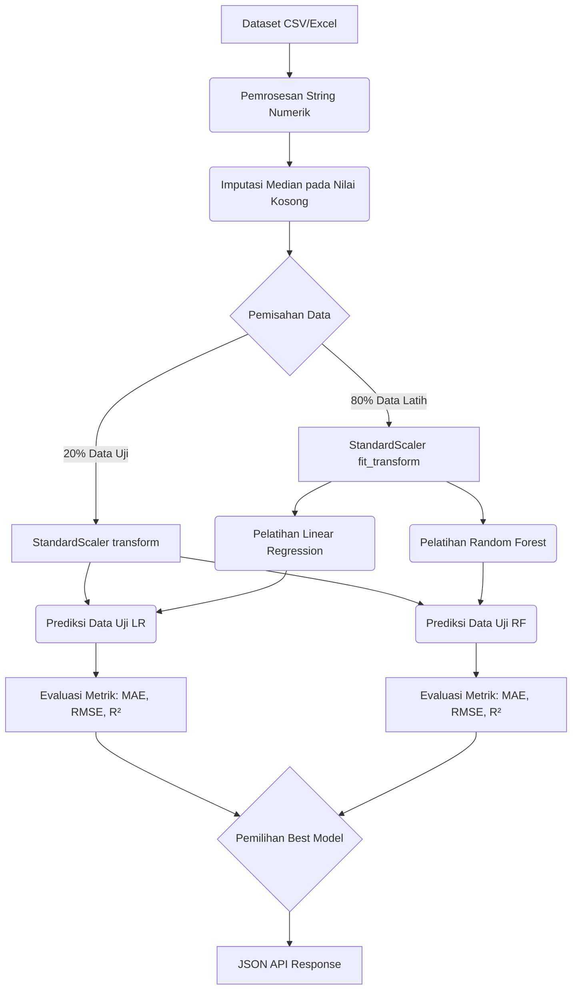
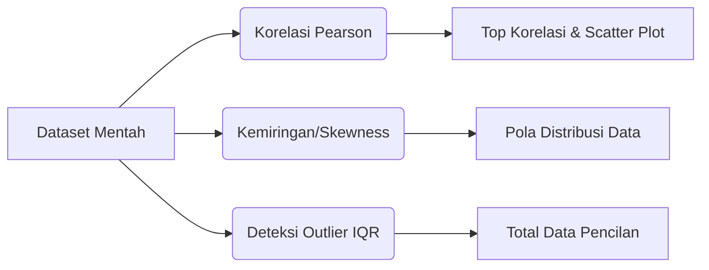
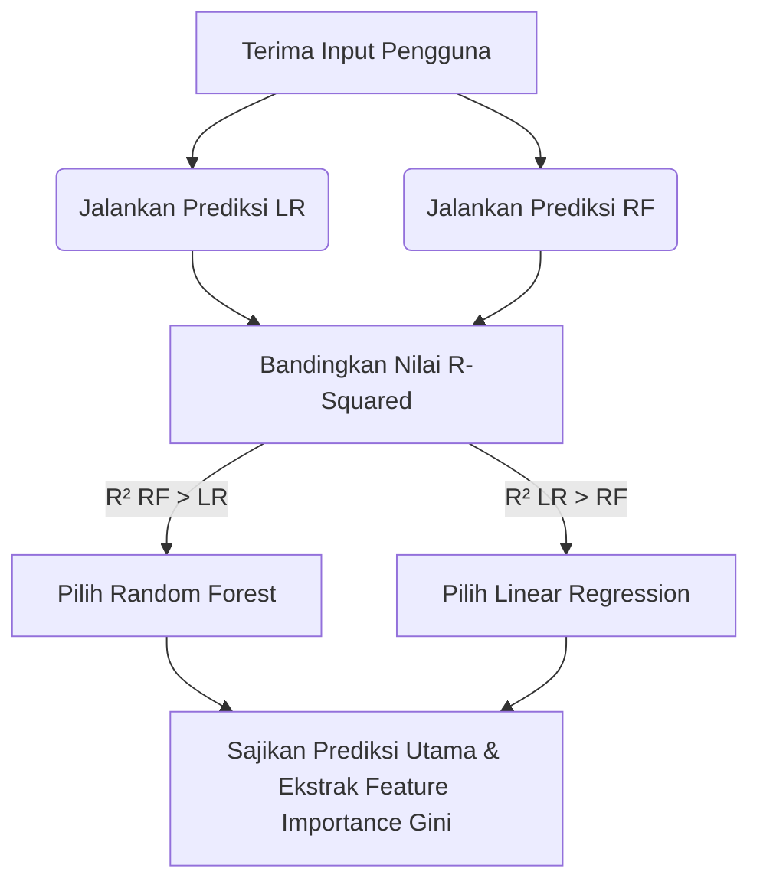

# 📘 Technical Documentation — Statistika & Machine Learning

Dokumen ini menjelaskan secara rinci alur, pemrosesan matematika, serta kalkulasi statistika yang terjadi di belakang layar (backend) pada Sistem Statistik Prediktif (PredictIQ). Semua proses pemodelan dienkapsulasi di dalam kelas `PredictiveModel` pada file `backend/ml_model.py`.

---

## 1. Alur Kerja Utama (Workflow Keseluruhan)

Diagram di bawah ini menggambarkan alur lengkap *end-to-end* sejak data diinput hingga model menghasilkan metrik prediksi.

---

## 2. Prapemrosesan Data (Data Preprocessing)

Sebelum algoritma *Machine Learning* dapat memprediksi nilai target (misalnya *GDP Growth*), sekumpulan data harus melewati tahapan prapemrosesan yang ketat.

### 1.1 Pembersihan String Numerik (Data Cleaning)
Ketika data diunggah dalam format CSV atau Excel, banyak angka yang terbaca sebagai tipe string/teks akibat adanya karakter asing (seperti `Rp`, `%`, pemisah ribuan, atau koma desimal versi Indonesia). Sistem melakukan *parsing* dengan heuristik cerdas:
- Karakter non-numerik (selain angka, titik, koma, minus) dihapus.
- Jika terdapat pola format angka Indonesia (misalnya `1.000.000,50`), sistem akan menukarkan tanda koma menjadi desimal standar US (titik) agar dapat dibaca oleh NumPy dan Pandas.

### 1.2 Imputasi Nilai Kosong (Missing Values)
Apabila dalam dataset terdapat baris yang kehilangan nilai (Missing/NaN) pada variabel numeriknya, nilai yang kosong tidak dihapus, melainkan **diimputasi menggunakan nilai Median**. 
- *Alasan menggunakan Median:* Tidak seperti Rata-rata (Mean), Median sangat kebal (*robust*) terhadap nilai pencilan (outliers) ekstrem yang sering ditemukan pada data ekonomi makro.

### 1.3 Pembagian Data (Train-Test Split)
Sistem menggunakan pendekatan *Hold-Out Validation* dari `scikit-learn`.
Dataset dibagi secara acak dengan proporsi **80:20**:
- **80% Data Pelatihan (Train Set):** Digunakan model untuk "belajar" menemukan pola historis.
- **20% Data Pengujian (Test Set):** Digunakan untuk menguji keakuratan model terhadap data yang tidak pernah dilihat sebelumnya.
- Pengacakan dilakukan dengan `random_state=42` agar eksperimen dan pembagian baris dapat direplikasi (reproducible).

### 1.4 Standarisasi Fitur (Feature Scaling)
Data ekonomi seperti "Populasi (Juta)" dan "Inflasi (%)" memiliki skala ukuran yang sangat berbeda jauh. Algoritma matematis akan kesulitan atau bias terhadap skala yang besar. Oleh karena itu, semua fitur ditransformasi menggunakan **StandardScaler (Z-Score Normalization)**:
$$ z = \frac{x - \mu}{\sigma} $$
Di mana $x$ adalah nilai asli, $\mu$ adalah rata-rata (mean), dan $\sigma$ adalah standar deviasi. Hasilnya, setiap fitur akan terpusat di angka 0 dengan standar deviasi 1. Masing-masing model (Linear Regression dan Random Forest) memiliki instance Scaler-nya sendiri agar tidak terjadi kebocoran data (*Data Leakage*).

---

## 2. Model Machine Learning

Sistem ini menjalankan **dua algoritma** Regresi secara simultan (bersamaan) lalu membandingkan efisiensi hasil pemodelannya.

### 2.1 Linear Regression (Regresi Linear Berganda)
Model parametrik klasik yang mencari garis (atau bidang/hyperplane) lurus paling optimal (Ordinary Least Squares) untuk meminimalkan selisih jarak (*residuals*) antara prediksi dan aktual.

- **Formula Matematika:**
  $$ y = \beta_0 + \beta_1 x_1 + \beta_2 x_2 + ... + \beta_n x_n + \epsilon $$
- **Penjelasan:** $y$ adalah prediksi target (misal PDB), $x_i$ adalah fitur pendukung (inflasi, investasi, dsb.), $\beta_i$ adalah koefisien bobot tiap fitur, $\beta_0$ adalah *intercept* (konstanta dasar), dan $\epsilon$ adalah galat (*error*).
- **Penggunaan:** Digunakan sebagai dasar komparasi linear (baseline). Sangat baik dalam mendeteksi korelasi lurus namun akan gagal memodelkan tren ekonomi yang sangat berfluktuasi/non-linear.

### 2.2 Random Forest Regressor
Algoritma berbasis Ansambel (*Ensemble Learning*) berjenis pembagian (*bagging*) yang bekerja secara non-linear. Secara konseptual, model ini membangun puluhan Pohon Keputusan (*Decision Trees*), kemudian hasil tebakan semua pohon "dirata-rata" untuk mendapatkan satu angka regresi penengah.

- **Hyperparameter Tuning (Bawaan):**
  - `n_estimators = 100`: Sistem menggunakan 100 pohon keputusan paralel.
  - `max_depth = 8`: Pohon maksimal bercabang 8 kali untuk menghindari *overfitting* yang umum terjadi pada dataset yang kecil.
  - `min_samples_split = 3`: Membutuhkan setidaknya 3 baris sampel untuk melanjutkan percabangan daun.
  - `min_samples_leaf = 2`: Sebuah ranting terakhir harus menaungi minimal 2 baris data.
- **Kelebihan dalam Statistika:** Mampu mengenali interaksi non-linear (misalnya: korelasi suku bunga terhadap inflasi tidak selalu lurus), serta secara intrinsik tangguh terhadap bahaya pencilan (*outliers*).

---

## 3. Metrik Evaluasi Model

Setelah model dilatih dengan 80% data, 20% sisa data (X_test) ditebak oleh mesin. Lalu hasil tebakannya dibandingkan dengan realita aslinya (y_test) menggunakan formula statistika berikut:

1. **MAE (Mean Absolute Error):**
   $$ MAE = \frac{1}{n} \sum_{i=1}^{n} | y_i - \hat{y}_i | $$
   Menghitung rata-rata nilai mutlak dari selisih simpangan. Nilai ini menggambarkan dengan bahasa intuitif: *"Secara rata-rata, prediksi mesin meleset sebesar {MAE} poin"*.

2. **RMSE (Root Mean Squared Error):**
   $$ RMSE = \sqrt{ \frac{1}{n} \sum_{i=1}^{n} (y_i - \hat{y}_i)^2 } $$
   Selisih simpangan dikuadratkan dulu agar penalti sangat memberatkan galat/kesalahan yang besar (*large errors/outliers*), baru diakar. Idealnya RMSE sangat dekat dengan nilai MAE. Jika RMSE jauh di atas MAE, artinya model memiliki sedikit kesalahan tetapi berbobot amat fatal.

3. **R-Squared ($R^2$ Score / Koefisien Determinasi):**
   $$ R^2 = 1 - \frac{\sum (y_i - \hat{y}_i)^2}{\sum (y_i - \bar{y})^2} $$
   Mengukur seberapa besar proporsi fluktuasi/variansi dari variabel target yang **berhasil dijelaskan** oleh fitur yang disediakan.
   - Nilai Maksimal 1.0 (100% sempurna). 
   - Nilai $0.80$ bermakna bahwa $80\%$ perubahan dari target mampu dijelaskan logikanya oleh pola fitur X, dan 20% sisanya disebabkan oleh faktor-faktor gaib lain di luar parameter dataset.

---

## 5. Exploratory Data Analysis (EDA)

Selain Machine Learning, modul API `/api/eda` menggunakan pandas/NumPy untuk menjalankan *statistika deskriptif*.

### 5.1 Korelasi Pearson (Linear Correlation)
Digunakan untuk melihat kaitan timbal-balik antar 2 fitur numerik secara linier:
$$ r_{xy} = \frac{\sum (x_i - \bar{x})(y_i - \bar{y})}{\sqrt{\sum (x_i - \bar{x})^2 \sum (y_i - \bar{y})^2}} $$
- Nilai $r$ berada di rentang **-1.0** (berkebalikan arah kuat) hingga **+1.0** (searah identik).
- Digunakan aplikasi pada bagian *"Fitur Paling Berpengaruh (Top Correlations)"* dan metrik Scatter Plot.

### 4.2 Skewness (Kemiringan Distribusi)
$$ \text{Skewness} = \frac{n}{(n-1)(n-2)} \sum \left( \frac{x_i - \bar{x}}{s} \right)^3 $$
Digunakan untuk mengecek apakah sebaran data condong (miring).
- **Nilai ~0:** Distribusi Normal / Bel (Gaussian).
- **Positif (>1):** Ekor distribusi menjulur ke kanan (Right Skewed / Positive Skewness).
- **Negatif (<-1):** Ekor distribusi menjulur ke kiri (Left Skewed).

### 4.3 Deteksi Outlier Ekstrem (Metode IQR)
Mendeteksi apakah terdapat data yang tidak wajar (pencilan) dengan menghitung batas Interkuartil.
1. Cari Kuartil 1 (P25) dan Kuartil 3 (P75).
2. Hitung rentang interkuartil: $IQR = Q_3 - Q_1$.
3. Tetapkan batas bawah wajar (Lower Bound) = $Q_1 - 1.5 \times IQR$.
4. Tetapkan batas atas wajar (Upper Bound) = $Q_3 + 1.5 \times IQR$.
5. Setiap nilai yang jatuh melewatinya secara resmi dilabeli sebagai Anomali/Outlier. Sistem menghitung total outlier ini dan melaporkannya di dashboard EDA.

---

## 6. Algoritma Pemilihan "Best Model"

Ketika *user* mengirim permintaan prediksi melalui endpoint gabungan (`/api/predict-compare`), sistem secara otomatis menjalankan algoritma turnamen antar-model:

1. Jika $R^2_{Random Forest} > R^2_{Linear Regression}$, maka mesin menyimpulkan Random Forest yang paling unggul (atau sebaliknya).
2. Prediksi akhir yang disarankan ke layar pengguna adalah murni keluaran dari *Best Model* tersebut.
3. Nilai *Feature Importance* (Tingkat Kepentingan Variabel) akan secara eksklusif dicabut dari hitungan *Gini Impurity* pada cabang algoritma Random Forest karena umumnya lebih akurat merepresentasikan peta kausalitas non-linier dibandingkan hanya bersandar pada bobot koefisien linear.
